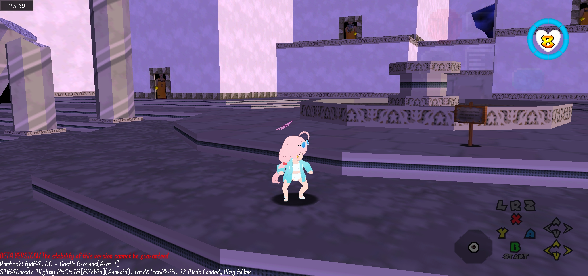

# 64 Short Debug [v0.1.4-beta]
Display essential SM64COOPDX debug information at the bottom-left corner of your screen, similar to the debug overlay found in many games.

## Features
Current features include (more coming soon):
- **CoopDX Version Spoofing**: Fake version display (since smlua doesn't provide native version check for CoopDX)
- **Toggleable Warnings**: Red "Beta Version" warning with on/off control
- **Quick Configuration**: ModMenu integration for easy settings
- **Essential Game Info**:
  - Current Course name + Area number
  - Active Romhack name (partial support)
  - CoopDX platform
  - Loaded mod count
  - Player name
  - Real-time ping display

> Note: Some romhacks may not display correctly due to implementation differences.